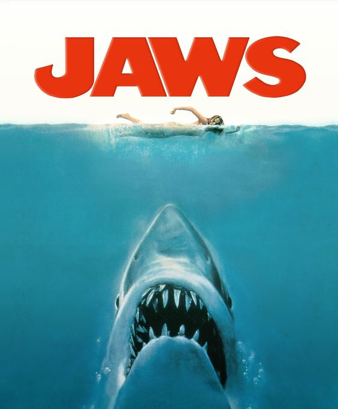

# 1_IRONHACK_Sharks

## Descripción del proyecto

Limpieza dataframe sharks. Primer proyecto dentro del bootcam IRONHACK Abril 2022
Las versiones de las distintas librerías usadas en el proyecto se pueden locarlizar en el archivo requirements.txt

## DafaFrame 

- attacks.csv
- Dimensiones: (25723, 24)

## Restricciones

- No se pueden eliminar columnas.
- Deben quedar al menos 6000 filas.

## Archivos

- `main.ipynb`, que contienge el código a ejecutar.
- `shark_func.py`, que contine funciones usadas en main.ipynb.

## Recursos

[Data Cleaning Tutorial](https://www.tutorialspoint.com/python/python_data_cleansing.html)

[Data Cleaning with Numpy and Pandas](https://realpython.com/python-data-cleaning-numpy-pandas/#python-data-cleaning-recap-and-resources)

[Data Cleaning Video](https://www.youtube.com/watch?v=ZOX18HfLHGQ)

[Data Preparation](https://www.kdnuggets.com/2017/06/7-steps-mastering-data-preparation-python.html)